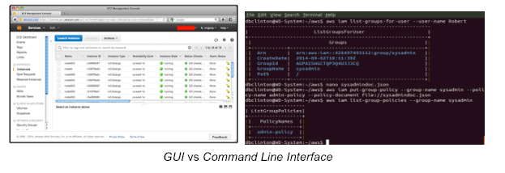

# Managed Services: How AWS helps you focus on your code

Developer teams spend too much time setting up and maintaining IT infrastructures. Instead of focusing solely on the solution of their problem, they instead spend resources on managing the tools. Using managed services like AWS you could dramatically reduce the work on the setup of your infrastructure and hand over responsibilities to self-managed services that do things right.

We have to host our website in the cloud but we don’t want to spend much time setting it up. We don’t want to be configuring and maintaining the server, such as installing the OS, required softwares and setting up users and access rights. We have a limited budget and we don’t really have time to keep watch of a server, in case it is unstable or not living up to expectations of handling a lot of requests.

The nature of managed services is that it handles the process of running software in production for a developer team. From installing the OS to running the application, handling security, requests, scaling and to handling updates. Managed services take off the work from the developer and let them focus on creating value for their company instead of managing the infrastructure.

## Security
A great thing about AWS, is that it contains a lot of security, which means that you can be a bit more relaxed on the security part on the user's side. You, of course, still have to take precautions but with AWS you’re able to keep an eye on everything that’s going on and then you can adjust your security accordingly.

### AWS Monitoring and Logging

You’re able to keep track of exactly what’s going on. This is done via the “AWS CloudTrail”, which have a visibility into the API and can see; who, what and from where calls have been made.
It’s also possible to set a “Alert Notification” via “Amazon CloudWatch” Which will notify when certain events occur.
AWS is also ensuring that all data is encrypted. This is done with AWS’s own service, where they manage the encrypted keys. Which has the benefit of working together with the CloudTrail, so that you can see logs of key usage.

### AWS Firewall

With this service you can easily configure the firewall to block out common attack patterns. It could be attacks such as cross-site scripting and SQL-injection. If more rules are needed, then it takes a very short time to add additional rules to the firewall. With the firewall you’re also able to see all the traffic in real-time visibility, which helps improving the security in a faster rate.
Lastly the actual servers of AWS. They’re guarded 24/7 by trained security guards on a facility that enforces least privilege basis. They’re also designed to tolerate and anticipate failures while still maintaining a service level. So that if a failure occurred, then an automated process will move the traffic away from the affected area.

## Managed Services

A large part of the software development life cycle is the maintenance and operations (Deploy and Maintain) of the running systems - up to 20-30%.

[1]

Self managed services take this out of your hands and provide you with a smooth development process where more developer time can be allocated to the design, development and testing of the product. Here is a few examples of the benefits you can get from using services that are managed by third parties.

### Scalability

It is hard to estimate what the amount of resources your system will require when the workload can be different and unpredictable. Horizontal and vertical scaling should have you covered, let’s have a look at what these mean. Horizontal scaling means adding more machines to your pool of resources. Vertical scaling means you scale by adding more power (CPU, RAM, storage) to your existing servers. You can choose which fits your use case better - but you can take advantage of both in the same time too.

The next time your traffic increases, you can spawn a few more servers with the same configuration. Having your configuration as code will help you programatically achieve this instead of pressing buttons on a GUI, which is hard to reproduce without errors and cannot be automated.

### No-downtime updates

For example, using Elastic Beanstalk with a Continuous Integration pipeline (e.g. CircleCI), after pushing your code to the VCS (Version Control System like Github or BitBucket), your code is built and deployed automatically without any downtime for the end user. But how is this achieved? When deploying a new version of your system, a new server instance is spawned and while the installation is in progress, all the requests to your website go to the previous running instance. Once the new version is ready to serve users, traffic from the previous server is rerouted to the new one and therefore causing no downtime.

### Reliability

These services were written by developers who are specialists in the technology. So whether it comes to scaling instances or firewall protection, we are better off relying on experts than reinventing the wheel every time when that itself does not always provide business value.

In our projects, we are satisfied with the integrity AWS helped us achieve. Elastic Beanstalk makes sure that the server is always running and when it goes down it is restarted immediately. Alerts are set up for notifying developers about downtime, logs are recorded for debugging and network is monitored to analyze the uptime of our systems.

## Pay per use

It is important mentioning that AWS is a great place for students to get started. They have a free tier which covers your expenses for most hobby uses or small projects. It is also easy to get a $100 voucher with a student email address.

The services of AWS are priced on a pay per use plan. This means you will only pay for what you actually use. So when your traffic increases to your website your bills will increase as well, but when traffic is low, you will not pay extra for what you don’t need. You need to be careful though, because when you release the next big thing and it goes viral you hope it is profitable enough to pay for the running costs of the server. It is, of course, possible to set limits and alerts on your usage.

### Pro Tip: use this for your advantage!

> Imagine you have an API that serves data about 1000 times a day. Let’s say a request takes 1 second to perform. That is 16 minutes of running business logic per day, but your server is running 24 hours a day to listen to these requests. That is a 99,98% time your resources are doing nothing. Now let’s replace your API with serverless Lambda calls. These calls are executed on a running server, but you only pay for that 1 second your code is being executed. This will reduce your running costs by a fold of 5000 in our simple example.

## Managed Services and Automation

One of the drawbacks of configuring your environment manually in a GUI is that it cannot be programmatically repeated. Somebody else has to come in, remember each step and spend the time redoing it without forgetting any of the steps. Sounds error prone, right?

One criticism of AWS is that we end up configuring too many things with fancy buttons and list views. However, using the AWS command line tool, most of these tasks can be coded and executed programmatically too. It will take some extra time figuring out their complex CLI, but that will pay off since this step does not need to be repeated again.

## Conclusion

Managed services help developers focus their attention on creating business value for their companies and take off the responsibility of managing, configuring and maintaining the server infrastructure. Multiple tools are available to achieve high-grade security, scalability, updates and much of the software development process.

The price paid for managed services is often times miniscule to the benefits gained in productivity.

Having hosted our website on AWS has been a great experience. In our projects it allowed us to spend the time on creating the website and the corresponding sub-systems, while also teaching us about aspects of website hosting like scaling, security, managed services in general etc. from an all-in-one cloud service provider.

## References

http://www.tothenew.com/blog/top-10-benefits-of-using-aws/

https://aws.amazon.com/security/

https://aws.amazon.com/waf/

https://aws.amazon.com/compliance/data-center/controls/

### Images

[1] https://cloudacademy.com/blog/become-an-aws-command-line-interface-expert-with-our-new-course/

http://oliverelliott.org/article/computing/tut_bio_aws/

https://www.sslsupportdesk.com/wp-content/uploads/2018/01/Amazon_Web_Services.png

https://www.geek.com/geek-cetera/the-11-funniest-hacker-attacks-1617998/

https://jokideo.com/piggy-bank-i-just-feel-so-empty/
